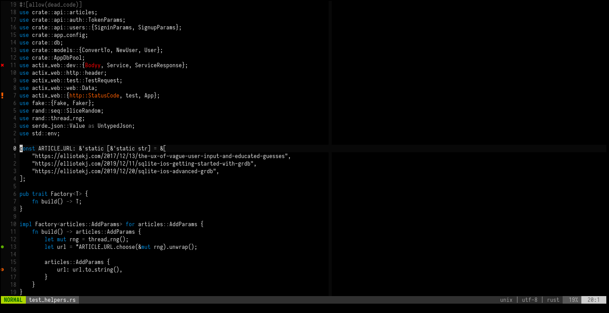

# enough.vim

`syntax off` is too little, most other colorschemes are too much. enough.vim
tries to find a happy medium between the two.

> NOTE: At the time of writing (08/01/2020), I’ve only been using this
> colorscheme for about a week. I still consider it to be a work in progress,
> albeit a work in progress that’s fairly far along. Contributions are welcome.

## Screenshot



## Installation

If you’re not already using a plugin manager, I recommend [vim-plug][1].

```viml
Plug 'elliotekj/enough.vim'
```

## Usage

```viml
colorscheme enough
```

## Plugin support

- [x] [ALE][2] signs.
- [x] [CoC][3] signs, highlights, and floats.
- [x] [GitGutter][4] signs.
- [x] [HTML5][5] syntax improvements.
- [ ] [JS][6] syntax improvements.
- [x] [Rust][7] syntax improvements.

## License

enough.vim is released under the MIT [`LICENSE`][8].

## About

enough.vim was written by [Elliot Jackson][9].

- Blog: [https://elliotekj.com/blog][10]
- Hire: [https://elliotekj.com/hire][11]
- Email: elliot@elliotekj.com

[1]: https://github.com/junegunn/vim-plug
[2]: https://github.com/dense-analysis/ale
[3]: https://github.com/neoclide/coc.nvim
[4]: https://github.com/airblade/vim-gitgutter
[5]: https://github.com/othree/html5.vim
[6]: https://github.com/pangloss/vim-javascript
[7]: https://github.com/rust-lang/rust.vim
[8]: https://github.com/elliotekj/enough.vim/blob/master/LICENSE
[9]: https://elliotekj.com
[10]: https://elliotekj.com/blog
[11]: https://elliotekj.com/hire
